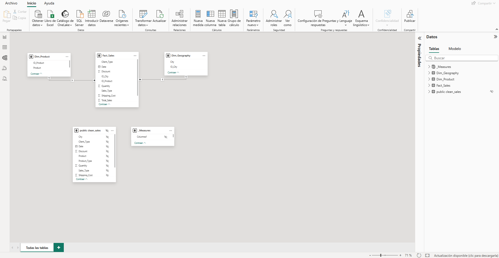
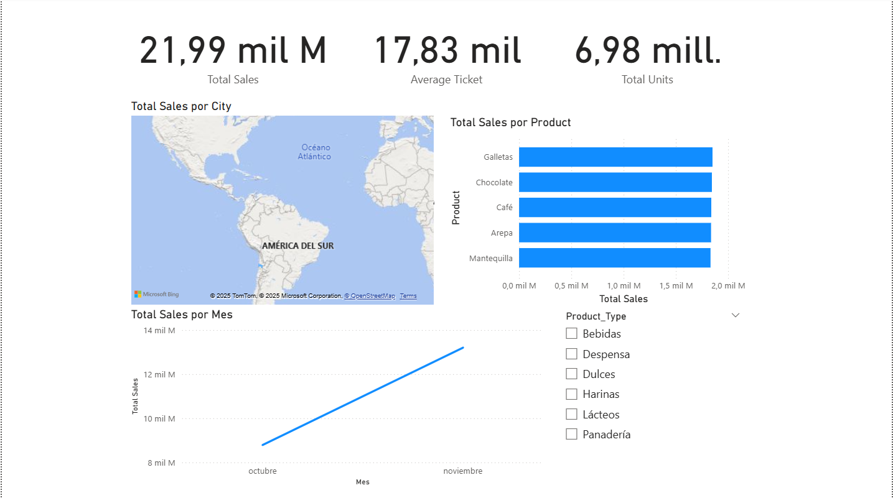

# 📊 Sales Analytics Pipeline & Dashboard


## 📖 Project Overview
This project simulates a complete **End-to-End Data Engineering & Analytics** solution. It processes a raw dataset of 1.25 million sales records, creates an automated ETL pipeline, stores data in a SQL warehouse, and delivers actionable insights through a Power BI dashboard.

The goal was to transform inconsistent raw data into a **Star Schema** model suitable for high-performance business intelligence analysis.

---

## 🏗️ Architecture & Tech Stack

**Pipeline Workflow:**
`Raw CSV` ➔ `Python (Pandas)` ➔ `PostgreSQL (Staging)` ➔ `Cleaning & Normalization` ➔ `PostgreSQL (Data Warehouse)` ➔ `Power BI`

*   **ETL & Logic:** Python (Pandas, SQLAlchemy, Regex).
*   **Database:** PostgreSQL (Hosted locally).
*   **Visualization:** Power BI (DAX, Star Schema Modeling).
*   **Environment:** Virtualenv, Dotenv security.

---
## 📂 Project Structure

```bash
sales-cape/
│
├── data/
│   └── raw/                        # Local storage for raw 'ventas.csv' (Ignored by Git)
│
├── docs/
│   ├── images/                     # Screenshots of the Dashboard & Star Schema
│   └── user_stories/               # Original requirements PDF
│
├── notebooks/
│   ├── 01_etl_load.ipynb           # Step 1: Ingestion & Staging to SQL
│   ├── 02_data_cleaning.ipynb      # Step 2: Cleaning, Regex & Normalization
│   └── 03_eda.ipynb                # Step 3: Exploratory Data Analysis & Statistics
│
├── reports/
│   ├── sales_dashboard.pbip        # Power BI Project entry point (CI/CD friendly)
│   ├── sales_dashboard.Report/     # JSON definitions for Visuals & Layout
│   ├── sales_dashboard.SemanticModel/ # DAX Measures & Data Model definitions
│   └── sales_dashboard.pbix        # Binary backup file
│
├── src/
│   ├── __init__.py
│   └── db_connection.py            # Reusable database connection module
│
├── .env                            # Environment variables (DB Credentials) - Not committed
├── .gitignore                      # Git exclusion rules
├── requirements.txt                # Python dependencies list
└── README.md                       # Project documentation
```
---
## 🎯 Methodology: User Stories (Agile)

This project was executed following an Agile approach, breaking down requirements into User Stories (HU).

### 🔹 HU 1: Connection & Ingestion
*Objective:* Connect Python to PostgreSQL and load raw data (1.2M rows).
*   **Achievement:** Successfully built a reusable DB connection module and ingested data into a Staging Table using chunking strategies for memory optimization.

### 🔹 HU 2: Data Cleaning & Normalization
*Objective:* Clean messy data (mixed types, special characters, logical inconsistencies).
*   **Key Actions:**
    *   Removed ~4,000 duplicate records.
    *   **Deep Cleaning:** Used Regex to remove artifacts like `***` or `@@@` from strings.
    *   **Logical Fix:** Standardized `Product_Type` using a master mapping dictionary (e.g., reclassifying "Arepa" from "Bebida" to "Harinas").

### 🔹 HU 3: Exploratory Data Analysis (EDA)
*Objective:* Python-based statistical analysis.
*   **Insights found:**
    *   Sales show high volatility ($23k Std Dev vs $17k Mean).
    *   A ~47% revenue growth observed from Oct to Nov 2025.
    *   Identified that Client Type does not significantly impact the median ticket size.

### 🔹 HU 4: Data Modeling (Star Schema)
*Objective:* Connect Power BI and model the data.
*   **Result:** Transformed the flat table into a Star Schema with:
    *   **Fact Table:** `Fact_Sales`
    *   **Dimension Tables:** `Dim_Product`, `Dim_Geography`
    *   **Validation:** 1-to-Many relationships verified.



### 🔹 HU 5: Dashboarding
*Objective:* Interactive visualization for decision making.
*   **Features:** Dynamic filtering by product, map integration with corrected geography hierarchies, and DAX-calculated KPIs.



---

## 🚀 How to Run this Project

1.  **Clone the repository:**
    ```bash
    git clone https://github.com/Elimge/sales-cape.git
    cd sales-cape
    ```

2.  **Set up the environment:**
    ```bash
    python -m venv venv
    source venv/bin/activate  # or .\venv\Scripts\activate on Windows
    pip install -r requirements.txt
    ```

3.  **Database Configuration:**
    Create a `.env` file in the root directory with your PostgreSQL credentials:
    ```ini
    DB_USER=postgres
    DB_PASSWORD=your_password
    DB_HOST=localhost
    DB_PORT=5432
    DB_NAME=hu_db
    ```

4.  **Run the ETL Pipeline:**
    Execute the notebooks in order:
    *   `notebooks/01_etl_load.ipynb` (Ingest)
    *   `notebooks/02_data_cleaning.ipynb` (Clean)
    *   `notebooks/03_eda.ipynb` (Analyze)

---

## 👤 Author
* **Miguel Canedo Vanegas** - *Data Analyst / Data Engineer* 
* Github: [`@Elimge`](https://github.com/Elimge)
* **Email:** elimge@outlook.com
